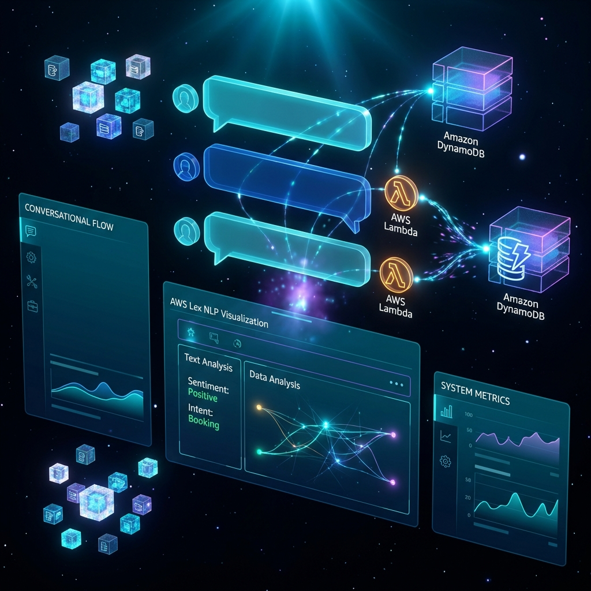

# Yatin Kande - AI & Data Engineering Portfolio

A professional, high-performance portfolio website built with **Next.js 14**, **TypeScript**, and **Tailwind CSS**. Designed to showcase expertise in AI, Data Science, and Full Stack Engineering with a premium "Data Analyst" aesthetic.



## 🚀 Features

-   **Premium Dark Mode UI**: capitalization on modern design trends with a sleek `slate-950` background and neon accents.
-   **Interactive Animations**:
    -   **Hero Typewriter**: Dynamic role cycling (Data Scientist → ML Engineer → Data Analyst).
    -   **Particle Background**: Mouse-following grid and spotlight effects.
    -   **Scroll Transitions**: Smooth entry animations for all sections using `Framer Motion`.
-   **Data-Driven "About" Section**: A "Personal Analytics Dashboard" featuring live metrics and an activity graph.
-   **Bento Grid Projects**: Asymmetrical, responsive grid layout for showcasing GitHub repositories with hover glow effects.
-   **Infinite Skills Marquee**: Auto-scrolling display of technical competencies.
-   **Fully Responsive**: optimized for Mobile, Tablet, and Desktop (split-screen ready).

## 🛠️ Tech Stack

-   **Framework**: [Next.js 14](https://nextjs.org/) (App Router)
-   **Language**: [TypeScript](https://www.typescriptlang.org/)
-   **Styling**: [Tailwind CSS](https://tailwindcss.com/)
-   **Animations**: [Framer Motion](https://www.framer.com/motion/)
-   **Icons**: [Lucide React](https://lucide.dev/)
-   **Deployment**: Vercel (Recommended)

## 🏃‍♂️ Getting Started

1.  **Clone the repository**:
    ```bash
    git clone https://github.com/YatinKande/portfolio-website.git
    cd portfolio-website
    ```

2.  **Install dependencies**:
    ```bash
    npm install
    ```

3.  **Run the development server**:
    ```bash
    npm run dev
    ```

4.  Open [http://localhost:3000](http://localhost:3000) with your browser to see the result.

## 📂 Project Structure

```bash
├── app/                  # Next.js App Router pages and layout
├── components/           # React UI components
│   ├── ui/               # Reusable UI elements (Background, etc.)
│   ├── Hero.tsx          # Landing section with typewriter effect
│   ├── About.tsx         # Data dashboard bio
│   ├── Projects.tsx      # Bento grid of works
│   └── ...
├── lib/                  # Utilities and data
│   ├── data.ts           # Centralized content (Bio, Skills, Projects)
│   └── utils.ts          # Helper functions (cn, etc.)
└── public/               # Static assets (images, icons)
```

## 🚢 Deployment

The easiest way to deploy this app is to use the [Vercel Platform](https://vercel.com/new).

1.  Push your code to GitHub.
2.  Import the project into Vercel.
3.  Vercel will detect Next.js and deploy automatically.

## 📄 License

This project is open source and available under the [MIT License](LICENSE).

---

Built with 💻 and ☕ by **Yatin Kande**.